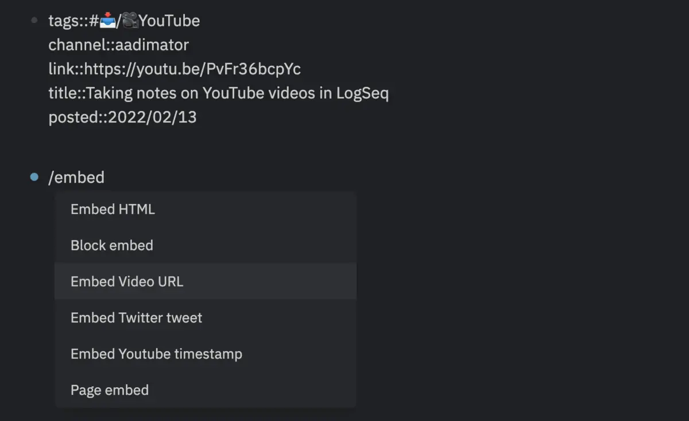
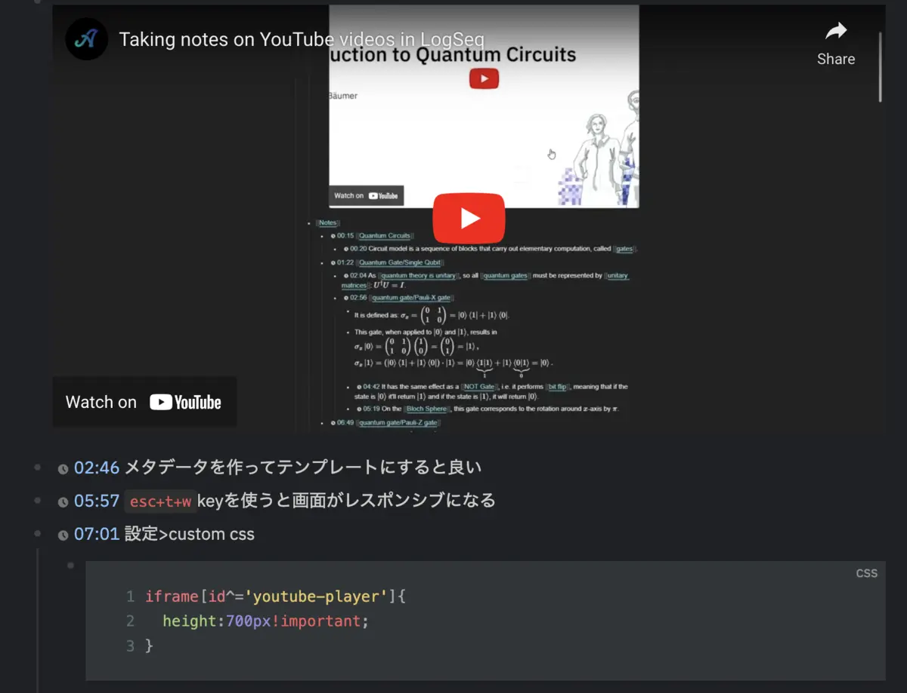

Logseq なら、YouTube 学習にとっても便利な、タイムスタンプをつけたメモが簡単に取れます。あたらしいことを学ぶとき、動画を活用することが多い私には嬉しい機能です。

きっかけは、この tweet を見かけたこと。へぇぇぇ。そんなことできたんだぁ、と思った次第です。



Logseq に YouTube の動画を埋め込んで、`cmd+shift+Y`するとタイムスタンプが貼り付けられるらしいんですが、embed のやり方が間違っていて少しバタついてしまいました（<-私の理解力の問題）。

なんのことはない、logseq のコマンドを使って埋め込みをすれば良いだけの話でした。だから簡単。

## 🎹 埋め込んで「cmd+shift+Y」する

`/`とタイプして(logseq のコマンドを呼び出して)Embed Video URL を選択



URL を入力 ex.`{{video https://youtu.be/PvFr36bcpYc}}`

ノートを取りたい場所にカーソルを移して`cmd+shift+Y`(Windowsd では`Ctrl+Shift+Y`らしいのですが、mac しかないので試してません))


## 💇 Custom CSS に記述してみる


この動画の 07:01 ごろに、動画の表示サイズがなんかちっさいから`設定>custom css`で変えちゃいましょう！っていうところがあります。ちなみに私も変えました。高さはお好みでどうぞ。

```css
iframe[id^="youtube-player"] {
  height: 500px !important;
}
```

なお、私 🐸 は、ページでも項目でも、メタデータを入れておくのが好みです。理由は、query を使って整理する（される）ときに便利だから。よく使うものはテンプレートを作っておきます。

## 🐸 まとめと感想

この投稿の本題と関係ないんだけど、twitter の埋め込みをしたら、きっとまた Speed Insight の点数が下がるんだろうなぁ 😮‍💨。
