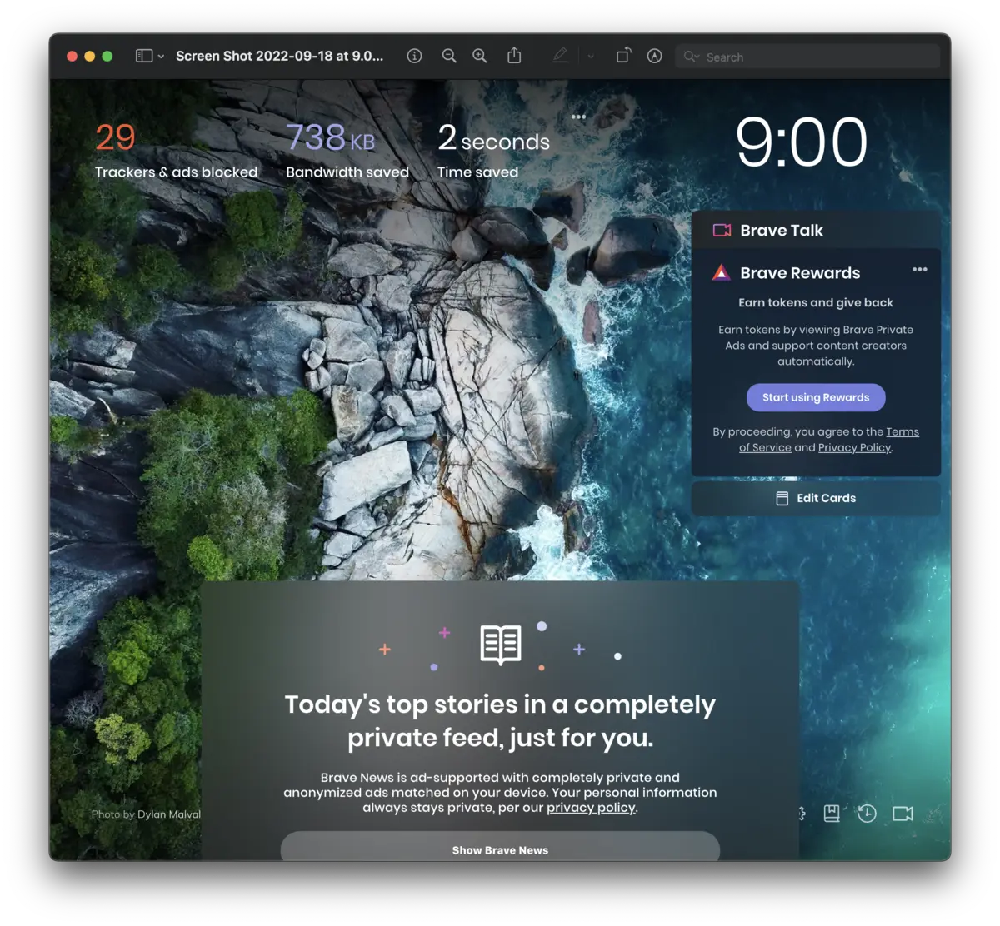

Brave というブラウザの存在を、今日はじめて知ってしまった。

もうすでに一年使っているよ！なんていう人がいたりして、知っている人には程よく知られているウェブブラウザらしい。





## 🧐 Brave って何?

> Brave（ブレイブ）は、Brave Software によって開発されているウェブブラウザである。Chromium をベースとしており、Windows、macOS、Linux、iOS、Android 版が存在し、オープンソースで開発されている。広告とトラッカーをブロックする機能を標準装備し、ユーザーのプライバシーの保護、そして高いパフォーマンスを実現できることを売りにしている。
> [Brave \(ウェブブラウザ\) \- Wikipedia](<https://ja.

一時期 [DuckDuckGo](https://duckduckgo.com/)のエンジンやブラウザを使ってみたのだが、そのときは（どういうわけだか） Developer モードは Chrome じゃなきゃダメだと思い込んでいたし（実際にそうだったのかはわからないけど）、なぁんとなく Chrome に戻ってしまったんですよね。

Brave は、いろいろどうなんだろう。どうでもいいけど、とにかく、エロ広告が大量に出てくるのとか、検索結果が微妙なのは、どうにかしてほしい。

なお、私が知ってしまったきっかけは、Quora の以下の秀逸回答です。


## 🌐 Brave をインストールする

インストールは簡単。

- ダウンロード：製品ページまたは、「Brave をダウンロードボタン」=すぐにダウンロードがはじまる
- インストーラーを実行：画面に従って、アプリを Applications に移動）
- ブラウザを起動して設定: 指示に従って Chrome の設定(ブックマーク、拡張機能)をインポート

ほんとに簡単、激早だった…。インポートを終えた状態で、いままで使っていたものは全て揃っているように見えます。

デフォルト画面(?)はこんな感じ。え、やだ 😍 超かわいい 💕

「既定のブラウザにする」については、「ちょっと試してみてから…」と思ってたんだけど、画面綺麗だからもっと使いたい！

ということで、`**Apple メニュー  >「システム環境設定」の順に選択し、「一般」をクリックします。** **「デフォルト Web ブラウザ」メニュー**`で brave を選択。

大好きなランチャー raycast で`https://search.brave.com/search?q={Query}`という Quick Link をつくり、併せて、で extension も導入しました。

## 🤔 Brave を使ってみる

さっそく使ってみましょう。広告多めリンク多め画像重めの韓国ドラマの個人紹介ページでテストしてみます。

ちなみに検索したドラマは今私がイチオシの『ユミの細胞たち』です（ドラマに罪はありませんどころか、素晴らしい作品です 💕)。



### - 検索結果

スッキリ。単純なリスト形式です。

あたりまえだけど、Google のファーストビューって、Google ピックアップの情報（というか、構造化データ対応している情報）が出てくるじゃないですか。ドラマだと出演者の写真とか、概要とか。あれが出ない。だからスッキリ

1 番目にあがってきたのが Chrome だと「[ユミの細胞たち - Prime Video - アマゾン」で、Brave は「#ユミの細胞たち 2- Twitter Search / Twitter」でした。twitter かぁ…。

2 番目以下は、**chrome は大手サイト**（line マンガ、Filmarks、Kboard、wikipedia、ELLE…）で、**brave は大小混合混戦**（個人、個人、kstyle, 個人...）。

### - 個別ページ

**表示早い**: brave が言うほど早いかはわかんないけど、早さ体感できます。画像大量でもビャッと表示 💨

**広告が出ない**: chrome では記事の上、目次の下、記事の下に入っているのですが、出ない。でも、サイト運営者が設定した自らのサービスの宣伝は入ります（当たり前か）。ちなみに YouTube なども brave から辿って web でみると広告が出なていないように思う。

### - その他

ブロックされたトラッカーや広告についての簡単なレポートが確認できます。URL の右側の 🦁（=brave ロゴ)をクリックすると、いくつブロックしたのかがわかります。

デフォルト言語として米国と英国の英語、フランス語、ドイツ語、**日本語**が選べます。

## 🔍 brave 検索エンジンだけ使う

Brave はブラウザも提供しているけど、検索エンジンも提供しています。たとえば、google の検索結果に不満を持っているけどブラウザは変えたくないという場合は、検索エンジンだけ使うというのもアリといえばアリ -> [検索エンジンを試す](https://search.brave.com/)

あれ、chrome で検索エンジンだけ brave にした場合と、brave ブラウザを使った場合とでは、検索結果の表示が違うなぁ。それでも chrome よりスッキリしてはいるけど。

ちなみに brave が掲げる「ユーザーファーストのプライベート検索」とは「独立していること」「透明性」「包括的プライバシー」の 3 つの柱で支えられています。この中で私の心に突き刺さったポイントは「透明性」における以下の記述です。

> 真の透明性
>
> Brave Search は、秘密の手法やアルゴリズムを使って結果にバイアスをかけたり検閲したりしません。結果の改善は匿名のコミュニティの貢献に、多様性の確保はコミュニティが作成した代替ランキングモデルに依存しています。

イマドキのサービスらしく brave も[コミュニティ](https://community.brave.com/)が充実していて、詳しいヘルプだとか、バグとかエラーとかが報告されたり、機能リクエストなんてものがあったりします。とてもオープンです。あ、[日本語コミュニティ](https://community.brave.com/c/japanese-support/148)もある。

## 🫰 配信元にもお金が落ちる仕組み

私はネットで情報を集めることが多く、日常的にとても助けられていて、情報提供元の皆さんにはとても感謝をしています。

だから、サイトを見るたびに広告をみなければならない状況も、まぁ仕方ないかなと受け止めていました。それで努力している人が報われるなら。ただ、広告よりも投げ銭"Buy Coffee"っぽい仕組みの方が好きといえば好き。

ところで、Brave にも、リワードの仕組みがあるらしいです。

> 他社の広告を消す代わりにユーザーは Brave が配信する広告を表示することができます。頻度は最高で 1 時間に 5 回まで。
>
> この広告を見ることでユーザーは BAT という仮想通貨を獲得できます。そのコインを仮想通貨取引所で売却したり、閲覧しているサイトに寄付したりすることが可能です。
>
> [後輩エンジニアから「まだ Google 検索で消耗してるんですか？時代は Brave ですよ。」と言われてしまいました。恥ずかしながら Brave を存じないのですが、どなたか解説して頂けませんか？に対する Junichi Uozumi さんの回答 \- Quora](https://jp.quora.com/%E5%BE%8C%E8%BC%A9%E3%82%A8%E3%83%B3%E3%82%B8%E3%83%8B%E3%82%A2%E3%81%8B%E3%82%89-%E3%81%BE%E3%81%A0Google%E6%A4%9C%E7%B4%A2%E3%81%A7%E6%B6%88%E8%80%97%E3%81%97%E3%81%A6%E3%82%8B%E3%82%93%E3%81%A7%E3%81%99%E3%81%8B-/answers/384549639?ch=10&oid=384549639&share=565d081c&srid=iiYWf&target_type=answer)

これについては[Brave Rewards FAQ - Brave Help Center](https://support.brave.com/hc/en-us/articles/360027276731-Brave-Rewards-FAQ)に説明があって、曰く「ユーザーがコントロールできる個人的なマッチング広告を見ることで BasicAttentionToken（BAT）を得ることができ、これはクリエイターを支援することにも使える」のだといいます。

まだ発展途上にある機能のようですし、仮想通貨とはなにやらハードルが高いようにも感じられますが、エロやサプリの広告を見ずして提供側を支援できるのなら、やってみたいなと思いました。

なお、この仕組みは**完全な opt-in で、自分で設定しない限りデフォルト設定されることはありません**。自分の行動が勝手に金銭化されたり仮想通貨にされたりすることもないそうです（逆に、_知らないうちに仮想通貨でボロ儲けということもありません_）。

## 🐸 まとめと感想

業務っぽいものではまだ使っていないけれど、今のところ好感触です。こんなに心穏やかに Web をサーフィン 🏄 できなんて、ちょっと感動的ですらあります。

iOS アプリも入れてみました。なんと 53 個もブロックされてる…😲
