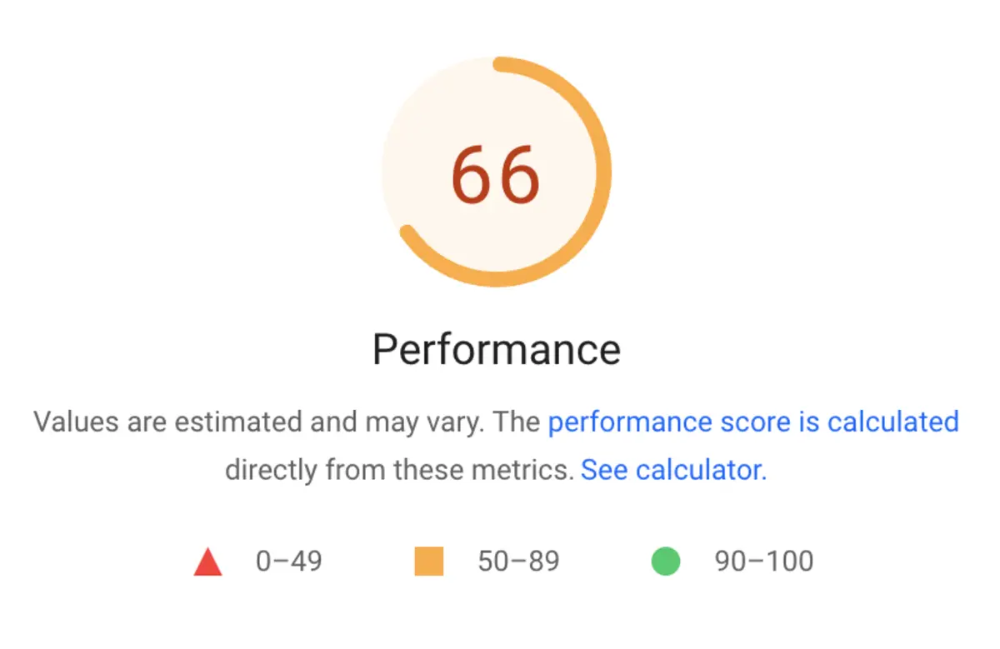
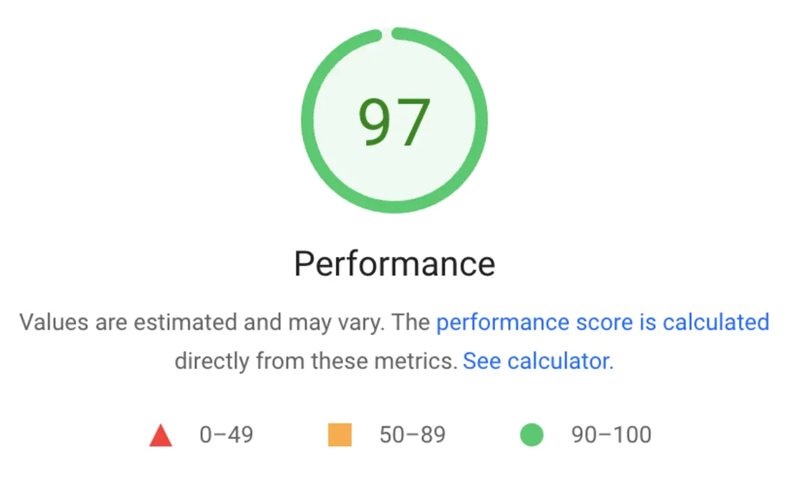

一つ前の[🥰 Brave というウェブブラウザを使ってみた](../../../posts/review/brave/index.md)という投稿に YouTube を埋め込んだのですが、これを[PageSpeed Insights](https://pagespeed.web.dev/)でテストしてみたら点数がとっても悪かった。



これを[lite\-youtube\-embed: A faster youtube embed\.](https://github.com/paulirish/lite-youtube-embed)を用いて高速化しました。



## 🐢 YouTube の埋め込み動画を入れると遅くなる

知らんかったのですが、とにかく普通に埋め込むと遅くなるそうで、実際にこのページ速度は 90 点以上をマークしている他のページに比べて激遅です（ちなみに Mobile）。

Brave のページに埋め込んだ動画は、本題とまったく関係がないので、外してしまおうかとも考えたのですが…。今後も含めて全く動画を利用しないというのは考えられず、できるなら改善したいなと考えた次第です。

[lite\-youtube\-embed](https://github.com/paulirish/lite-youtube-embed)を確認したら、Contributors も Used by も多い。

しかも

> This custom element renders just like the real thing but approximately 224× faster. このカスタム要素は、実際のものと同じようにレンダリングされますが、約 224× 高速です。

とか書いてある。224 倍ですか 😲

[facade を使って YouTube 動画を埋め込む \(YouTube Lite Embed\)](https://misc.laboradian.com/web-test/017/)というページによると「このライブラリを使うと、YouTube 動画のサムネイルだけ表示して、動画のデータは取得しない。そのためページ読み込みのパフォーマンスが高い。」とのこと。ページでは、デモとテストの結果が完結に記されています。

## 🛠️ lite-youtube-embed を導入する

なんか良さそうなので、私もやってみることに。レポジトリから npm するか、またはダウンロードで使えます。

まるっと`git clone`しちゃったのですが、使用するだけなら必要なのは`src`にある`lite-yt-embed.css`と`lite-yt-embed.js`の 2 ファイルのみ。

これをディレクトリに保存し、`<head>`で読み込むように指定します。私は`static/css`と`static/js`にそれぞれ放り込みました。

なので`<head>`の中の記述は以下のとおり。ちなみに利用している hugo theme は mainroad です。

```html
<!-- layouts/_default/baseof.html -->
<link rel="stylesheet" href="/css/lite-yt-embed.css" />
<script src="/js/lite-yt-embed.js"></script>
```

## 🎬 lite-youtube-embed を使用する

投稿には`iframe`ではなく`lite-youtube`を記述し、js を実行します。なので、（またしても）shortcode を作って、

```html
<!--layouts/shortcodes/youtube.html-->
<lite-youtube
  videoid="{{ .Get 0 }}"
  playlabel="Play: Keynote (Google I/O '18)"
></lite-youtube>
```

投稿に表示したい動画の url が`https://youtu.be/iWAfxKx770M`なら``とすると、こんな感じ ↓ に表示されます。


<br /><br />
目視でわかるほど劣化している訳ではないし、特におかしくもない。

## 👎 スマホでは 2 度押し必要

なお、弱点は、**スマートフォンや特定のブラウザではプレイボタンを 2 度押ししないと動画が再生されない**という点でしょうか。しかしながら、私のブログは動画が主体ではないし、2 度押してもらっても問題は特にない。

## 👍 成績向上（97 点）。そしてパラメーターも使える

PageSpeed Insights の追試では 97 点をもらえました。



それから、YouTube の埋め込みでは設定を（[パラメーター](https://developers.google.com/youtube/player_parameters#Parameters)で指定できますが、`lite-youtube`の中でもこれが使えます。

こんな感じ（[paulirish/lite\-youtube\-embed: A faster youtube embed\.](https://github.com/paulirish/lite-youtube-embed)より）。

```html
<!-- Example to show a video player without controls, starting at 10s in, ending at 20s, with modest branding *and* enabling the JS API -->
<lite-youtube
  videoid="ogfYd705cRs"
  params="controls=0&start=10&end=30&modestbranding=2&rel=0&enablejsapi=1"
></lite-youtube>
```

必要なら css でスタイルも変えることができます。私は動画の下にスペースを入れたかったので、`margin-bottom: 2em;`を追加しました。

## 🐸 まとめと感想

受験生さながらにスピードテストしまくっています。成績が良くなってお母さんは嬉しい ✨。だけど、なんか振り回されている感じがするなぁ。

あともう一つ気になるのが、こんなにたくさん shortcode 作ってもいいんだろうか?という点。なんかもっと頭良い方法があるのではなかろうか…🤔
